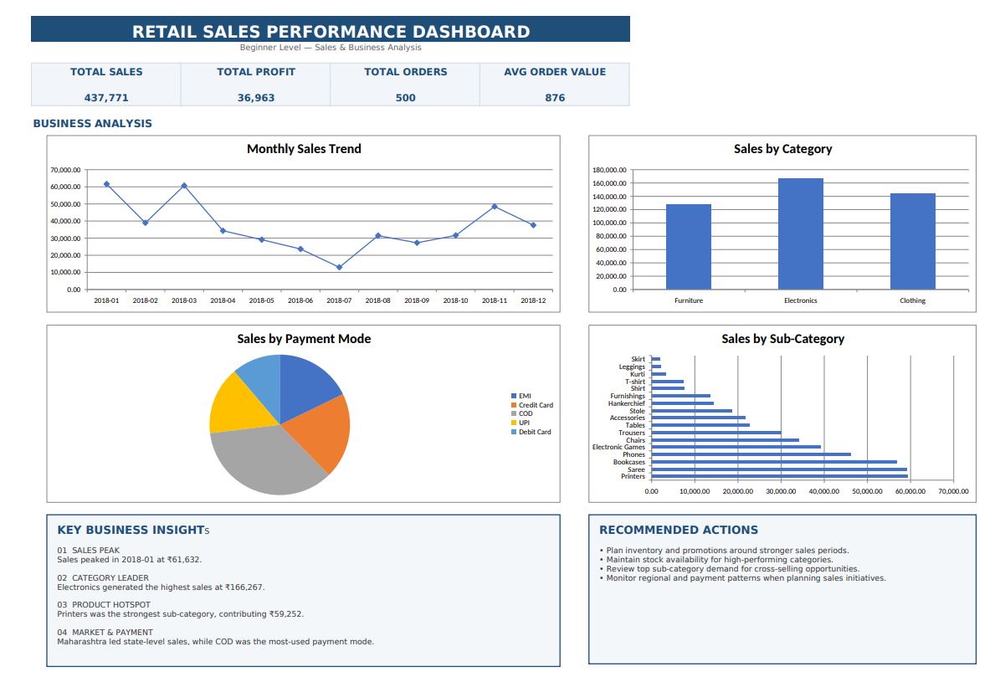
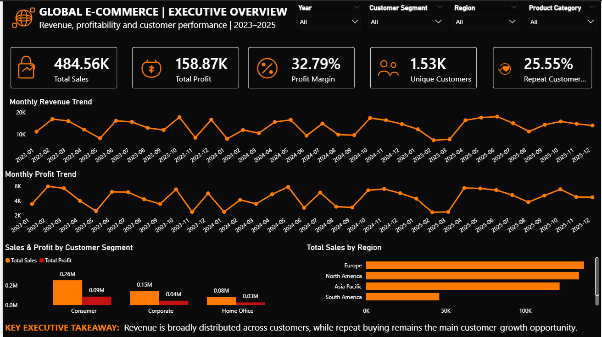
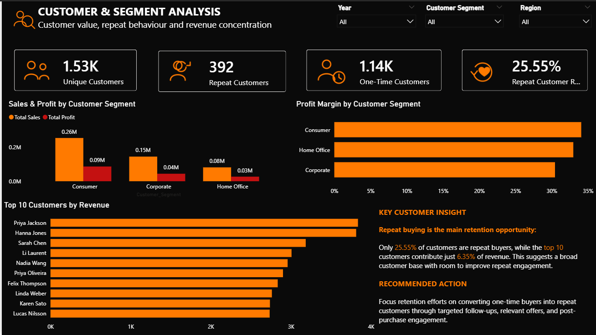
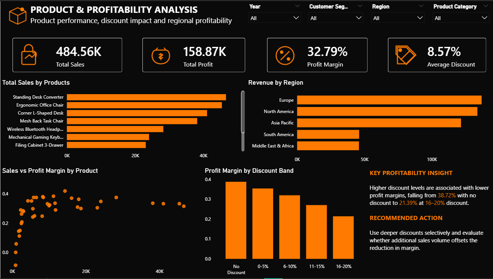
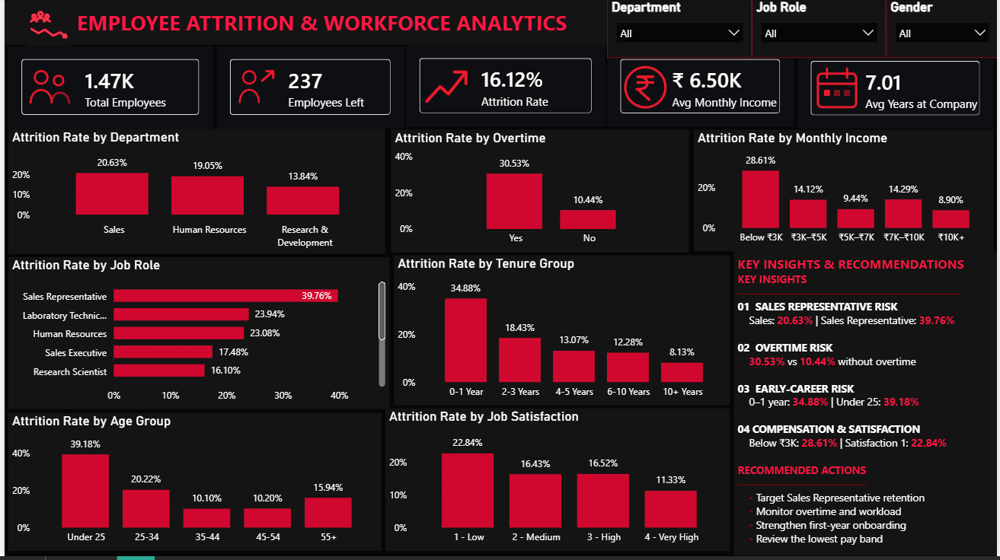

# ShadowFox Data Analyst Internship

A three-level data analytics portfolio completed as part of the **ShadowFox Data Analyst Internship**, covering **Beginner, Intermediate, and Advanced** projects.

The projects show my progression from basic spreadsheet analysis to deeper business analytics and finally to interactive, decision-oriented Power BI dashboards.

---

## Internship Overview

This internship was structured across three levels, with each level increasing in analytical depth and technical complexity.

### Beginner
**Retail Sales Analysis Dashboard**

A Microsoft Excel project focused on data cleaning, basic exploratory analysis, sales trends, category performance, and dashboard creation.

### Intermediate
**Global E-Commerce Customer & Revenue Analytics**

An Excel + Power BI project focused on customer behaviour, segment performance, profitability, discount analysis, regional performance, and interactive reporting.

### Advanced
**Employee Attrition & Workforce Analytics**

A Power BI project focused on HR attrition patterns, workforce risk areas, reusable DAX measures, interactive filtering, and executive-style decision support.

---

# 1. Beginner — Retail Sales Analysis

## Project Overview

The Beginner project was my starting point for the internship.

I worked with the **Madhav E-Commerce Sales Dataset** and used Microsoft Excel to combine, clean, and analyze order and transaction data.

The goal was to understand basic sales performance and turn the raw data into a simple dashboard that could be understood quickly.

### What I worked on

- Combined related Orders and Details data using Order ID
- Checked data types and missing values
- Validated duplicate records
- Calculated core sales and profit metrics
- Analyzed monthly sales trends
- Compared categories and sub-categories
- Examined state-level performance
- Analyzed payment methods
- Built an Excel dashboard with KPIs and charts

### Key Metrics

- Total Sales — **₹437,771**
- Total Profit — **₹36,963**
- Total Orders — **500**
- Average Order Value — **₹876**

### Key Findings

- **January 2018** was the strongest sales month at approximately **₹61,632**
- **July 2018** was the weakest month at approximately **₹12,966**
- **Electronics** generated the highest sales at approximately **₹166,267**
- **Clothing** generated the highest total profit at approximately **₹13,325**
- **Printers** were the strongest sub-category at approximately **₹59,252** in sales
- **Maharashtra** recorded the highest state-level sales at approximately **₹102,498**

### Tools

- Microsoft Excel
- Excel Tables
- Spreadsheet analysis
- Charts and dashboard design

### Beginner Dashboard



---

# 2. Intermediate — Global E-Commerce Customer & Revenue Analytics

## Project Overview

The Intermediate project moved beyond basic sales reporting and focused more on **customer behaviour, revenue, profitability, segments, discounts, and regional performance**.

I used **Excel for data preparation and exploratory analysis**, followed by **Power BI for the interactive report**.

The analysis was designed around practical questions such as:

- Which customer segments generate the most value?
- How many customers return for another purchase?
- Which products drive revenue?
- How do discounts relate to profitability?
- Which regions perform strongly in both revenue and margin?

### Dataset Profile

- **2,000 rows**
- **15 original fields**
- **20 countries**
- **5 regions**
- **4 product categories**
- **40 products**
- **1,534 unique customers**
- **2,000 unique orders**
- **0 missing values**
- **0 fully duplicated rows**

### Data Preparation

The dataset was prepared in Excel before being used in Power BI.

The preparation included:

- Data quality checks
- Data type validation
- Text standardization
- Missing-value checks
- Full-row duplicate checks
- Creation of analytical fields

Additional fields included:

- Order Year
- Order Month
- Order Month Name
- Profit Margin %
- Discount Band

### Key Metrics

- Total Sales — **$484,559.34**
- Total Profit — **$158,872.32**
- Total Quantity — **7,115**
- Total Orders — **2,000**
- Unique Customers — **1,534**
- Average Order Value — **$242.28**
- Average Profit per Order — **$79.44**
- Average Discount — **8.57%**

### Customer Findings

- **392** customers made repeat purchases
- **1,142** customers purchased only once
- Repeat customer rate was **25.55%**
- The top 10 customers contributed only about **6.35% of total revenue**

This suggested that revenue was broadly distributed, while repeat buying was a larger opportunity for improvement.

### Segment Findings

**Consumer**
- Sales — approximately **$256.29K**
- Profit — approximately **$87.30K**
- Profit Margin — approximately **34.06%**

**Corporate**
- Sales — approximately **$146.05K**
- Profit — approximately **$44.46K**
- Profit Margin — approximately **30.44%**

**Home Office**
- Sales — approximately **$82.22K**
- Profit — approximately **$27.11K**
- Profit Margin — approximately **32.97%**

### Discount & Profitability

One of the clearest patterns in the project was the relationship between discount depth and profit margin:

| Discount Band | Profit Margin |
|---|---:|
| No Discount | 38.72% |
| 0–5% | 35.36% |
| 6–10% | 31.93% |
| 11–15% | 27.02% |
| 16–20% | 21.39% |

Higher discount levels were associated with lower profit margins. This is treated as an observed relationship in the data, not as proof that discounts directly caused the decline.

### Regional Findings

- **Europe** — approximately **$137.01K** sales
- **North America** — approximately **$133.88K** sales
- North America recorded the strongest regional margin at approximately **33.80%**
- Europe recorded approximately **33.34%**

### Power BI Report

The final report contains three pages:

**Executive Overview**
- Revenue and profit KPIs
- Profit margin
- Customer metrics
- Monthly revenue and profit trends
- Segment performance
- Regional revenue
- Interactive slicers

**Customer & Segment Analysis**
- Unique customers
- Repeat customers
- One-time customers
- Repeat customer rate
- Sales and profit by segment
- Profit margin by segment
- Top 10 customers by revenue

**Product & Profitability Analysis**
- Top products by revenue
- Sales vs profit margin by product
- Profit margin by discount band
- Regional revenue and profitability
- KPI cards and slicers

### Intermediate Dashboards







### Tools

- Microsoft Excel
- Microsoft Power BI
- Power Query / data preparation
- DAX
- Power BI data modeling
- Interactive slicers
- Dashboard design

---

# 3. Advanced — Employee Attrition & Workforce Analytics

## Project Overview

The Advanced project focused on **employee attrition and workforce risk analysis** using employee-level HR data.

The goal was to build a Power BI dashboard that would help HR stakeholders understand where attrition is concentrated and which workforce groups may require closer attention.

The analysis focused on:

- Department
- Job Role
- Overtime
- Monthly Income
- Tenure
- Age Group
- Job Satisfaction

### KPI Cards

- Total Employees — **1.47K**
- Employees Left — **237**
- Attrition Rate — **16.12%**
- Average Monthly Income — **₹6.50K**
- Average Years at Company — **7.01**

### Interactive Slicers

- Department
- Job Role
- Gender

### Analytical Visuals

- Attrition Rate by Department
- Attrition Rate by Job Role
- Attrition Rate by Overtime
- Attrition Rate by Monthly Income
- Attrition Rate by Tenure Group
- Attrition Rate by Age Group
- Attrition Rate by Job Satisfaction

### Key Insights

**Sales Representative Risk**

Sales had a **20.63%** attrition rate, while Sales Representatives reached **39.76%**, showing that the risk was particularly concentrated in this role.

**Overtime Risk**

Employees working overtime had a **30.53%** attrition rate compared with **10.44%** for employees who did not work overtime.

**Early-Career Risk**

Employees with **0–1 year** of tenure had a **34.88%** attrition rate, while employees under 25 had a **39.18%** attrition rate.

**Compensation & Satisfaction**

Employees earning below **₹3K** had a **28.61%** attrition rate, while the lowest job-satisfaction group had a **22.84%** attrition rate.

### Recommendations

- Target retention efforts toward Sales Representatives
- Monitor overtime and workload distribution
- Strengthen first-year onboarding, mentoring, and career support
- Review the lowest compensation band with targeted retention actions

### Dashboard Preview



### Tools

- Microsoft Power BI
- Power Query / data preparation
- DAX
- Power BI Report View
- Power BI Data / Model View
- Interactive slicers

### Analytical Note

The dashboard identifies **associations and risk signals**, not proven causal relationships.

For example, overtime is associated with higher attrition in the data, but the analysis does not establish that overtime directly causes employees to leave.

---

# Progression Across the Internship

The three projects represent a clear progression in both technical skills and analytical thinking.

| Area | Beginner | Intermediate | Advanced |
|---|---|---|---|
| Project | Retail Sales Analysis | Global E-Commerce Analytics | Employee Attrition Analytics |
| Main Tools | Excel | Excel + Power BI | Power BI |
| Analysis | Descriptive | Customer, segment & profitability | Multi-dimensional HR risk analysis |
| Visualization | Excel charts | Multi-page Power BI report | Executive Power BI dashboard |
| Interactivity | None | Slicers | Interactive slicers and filter context |
| Main Question | What happened? | What happened and what patterns are visible? | Where is risk concentrated and what should be considered? |
| Recommendations | General business actions | Segment and discount-based actions | Targeted HR retention actions |

The progression was not just about using more advanced software. Each level required a deeper understanding of the business question and a more thoughtful approach to interpreting the data.

---

# Skills Developed

Across the three projects, I developed practical experience in:

- Data cleaning and preparation
- Data validation
- Excel-based analysis
- Spreadsheet dashboarding
- Exploratory analysis
- KPI development
- Customer and revenue analysis
- Profitability analysis
- Trend analysis
- Power BI report design
- Power BI data modeling
- DAX measures
- Interactive slicers
- Business storytelling
- Insight generation
- Recommendation writing

The Beginner project gave me the foundation in structured spreadsheet analysis. The Intermediate project helped me think more deeply about customers, profitability, and business segments. The Advanced project pushed that thinking into an interactive, decision-oriented Power BI dashboard.

---

# Overall Takeaways

A few ideas consistently appeared across the three projects:

- Looking only at total performance can hide important differences between segments.
- Revenue and profitability do not always tell the same story.
- Concentrating analysis on meaningful groups makes business patterns easier to understand.
- Interactive dashboards are more useful when they help stakeholders investigate a question rather than simply display numbers.
- Recommendations should be tied directly to the evidence rather than added as generic advice.

---

# Project Workflow

The overall workflow across the internship was:

**Dataset Selection → Data Cleaning & Preparation → Exploratory Analysis → Business Questions → KPI Development → Visualization → Business Insights → Recommendations → Dashboard / Report**

The process became more detailed at each level, but the basic analytical thinking remained the same.

---

# Repository Structure

```text
employee-attrition-workforce-analytics/
│
├── README.md
├── LICENSE
│
├── Final_Internship_Report.pdf
│
├── Beginner/
│   ├── Beginner_Retail_Sales_Analysis.xlsx
│   └── beginner_dashboard.png
│
├── Intermediate/
│   ├── Global_ECommerce_Customer_Revenue_Analytics.pbix
│   ├── intermediate_executive_overview.png
│   ├── intermediate_customer_segment.png
│   ├── intermediate_product_profitability.png
│   └── global_ecommerce_sales.xlsm.xlsx
│
└── Advanced/
    ├── Employee_Attrition_Workforce_Analytics.pbix
    ├── final_dashboard.png
    └── WA_En-UseC_-HR-Employee-Attrition.csv
